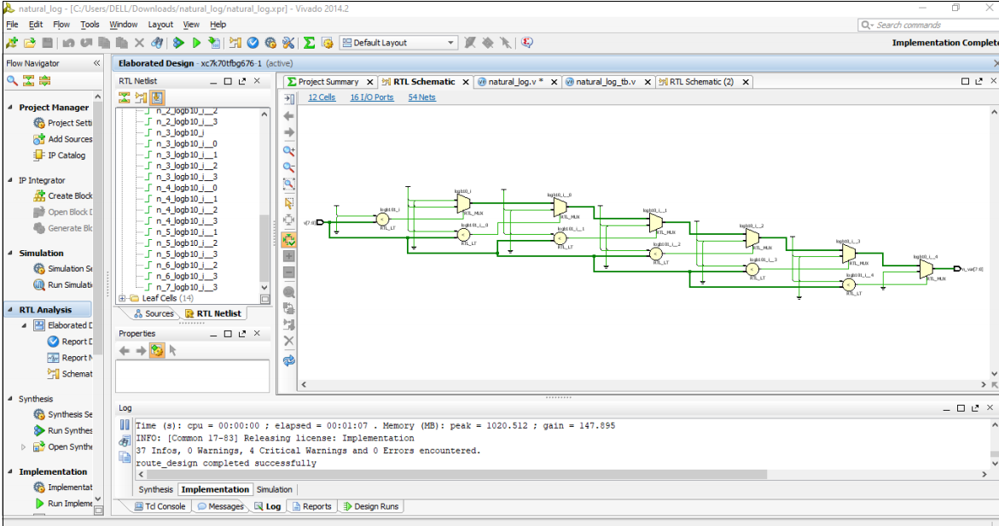
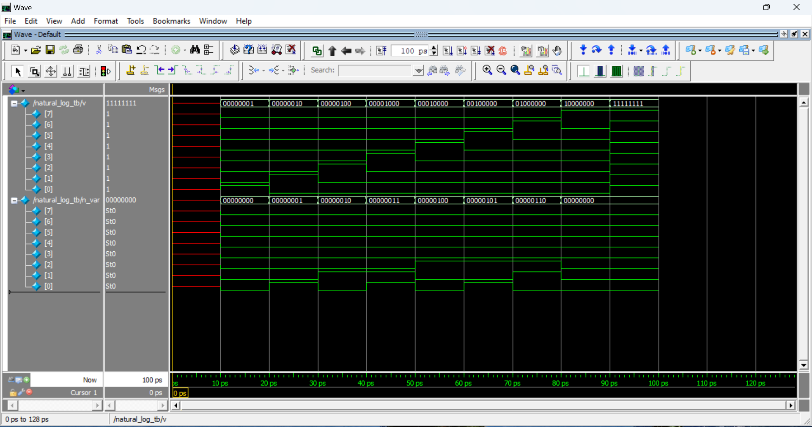

# 8 Bit natural Log Implementation using Verilog.

Design and implement a logarithmic function Y = ln(X) for 8 bit inputs using verilog and AMD-xilinx platform.


## Introduction Theory
Exponential and logarithmic functions are no exception! Much of the
power of logarithms is their usefulness in solving exponential
equations and also use to solve various electrical circuit analysis
problems. Some examples of this include sound (decibel measures),
earthquakes (Richter scale), the brightness of stars, and chemistry
(pH balance, a measure of acidity and alkalinity).

 In mathematics, the logarithm is the inverse function to exponentiation. That means the logarithm of a given number x is the exponent to which another fixed number, the base b, must be raised,to produce that number x.

In the simplest case, the logarithm counts
the number of occurrences of the same factor in repeated multiplication; e.g., Log base “e” = ln so as ex. the "Natural logarithm
base e" of 10 is 3, or ln(10) = 3.000(2.71* log10(10)). The logarithm of x to base b is denoted as logb(x), or without parentheses, logb x, or even without the explicit base, log x, the logarithm base 10 (that is b = 10) is called the decimal or common logarithm and is commonly used in science and engineering. The natural logarithm has the number e (that is b ≈ 2.718) as its base; its use is widespread in mathematics and physics, because of its simpler integral and derivative. The binary
logarithm uses base 2 (that is b = 2) and is frequently used in computer science. Logarithms are examples of concave functions.

## Results 
"I implemented the RTL design, including the nets and wire-level configuration, using the AMD-Xilinx Vivado platform. Additionally, I generated the waveform using the ModelSim platform."






## Algorithm or State Diagram

This README describes the flowchart of the `natural_log` Verilog module, which computes the natural logarithm approximation of an 8-bit input value `v` and outputs the result in `n_var`.

---

## 📋 Flowchart

```plaintext
     Start
       │
       ▼
  Input v [7:0]
       │
       ▼
  Is v == 0?
     / \
   Yes  No
    │    │
    ▼    ▼
n_var=0  Continue
    │      │
    │      ▼
    │   Initialize 
    │  log_val = 0
    │      i = 0
    │      │
    │      ▼
    │   Loop i < 8
    │      │
    │      ▼
    │   Is (1 << i) > v?
    │     / \
    │   Yes  No
    │    │    │
    │    ▼    ▼
    │ log_val= i-1
    │    i=8 Increment i
    │      └────┘
    │      │
    ▼      ▼
  End  Assign n_var = 
        log_val[7:0]
              │
              ▼
             End
